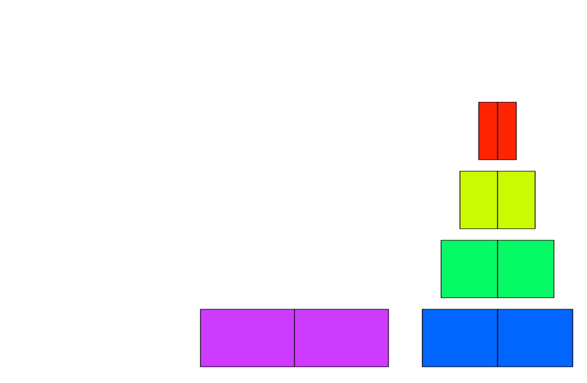
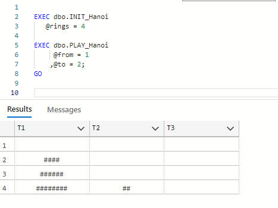
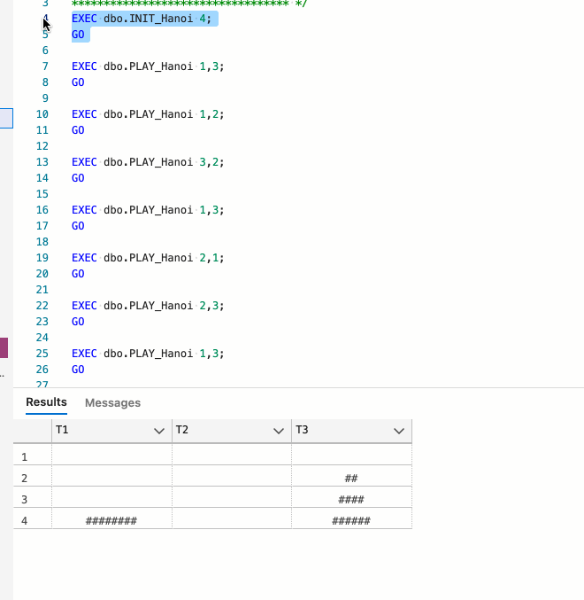

# Tower of Hanoi - T-SQL Game

Github Repository with T-SQL Code  for Microsoft SQL Server for playing popular game: 'Tower of Hanoi' in your favorite editor.

## About the game

Tower of Hanoi is puzzle game consisting of three rods and number of rings (disks) of different size (diameters). Rings are slide into any rod. Game begins with all rings stacked on one rod, ordered by descending size - from smallest on top, to biggest at the bottom.
The purpose of the game is to move the entire stack of rings from first to last rod, ordered by decreasing size.
Two simple rules apply:
1. only one ring can be moved at the time
2. bigger ring can not be stacked on smaller ring
3. each move consists of taking upper most ring and placing it on the other rod (on top of another stacked rings or on empty rod)


<div style="text-align:center"></div>


## T-SQL Procedures for the game

Game has two simple procedures. The initialization of the table for the background information store is created with ```dbo.INIT_Hanoi``` procedure. And the play procedure for moving and stacking the rings around the rods, done with ```dbo.PLAY_Hanoi```.

Three T-SQL files are available:
1. Tower_Hanoi.sql - the script to the actual game
2. Play_Game.sql - the sample gameplay 
3. AutoSolve.sql - the SQLCMD gameplay for autosolving the game and watching the output in command-line.

# Playing the game

After running the content of Tower_Hanoi.sql file (creating two procedures ```dbo.INIT_Hanoi``` and ```dbo.Play_Hanoi``` ), start the game with:

```
EXEC dbo.INIT_Hanoi
   @rings = 4
```

And continue playing the game:

```
EXEC dbo.PLAY_Hanoi
     @from = 1
    ,@to = 2;
GO

EXEC dbo.PLAY_Hanoi
     @from = 1
    ,@to = 3;
GO
```

Opening the game in Azure Data Studio or in SSMS, the outlook do the game should be:


<div style="text-align:center"></div>

Game prevents you to make illegal moves and resets when you restack all the rings onto a different rod (last rod).


Actual Gameplay using Azure Data Studio (ADS):

<div style="text-align:center"></div>

# Autosolver using SQL Server SQLCMD

Solving Tower of Hanoi game can be done by using SQL Server command line with a single procedure ```dbo.AutoSolver```, available in AutoSolve.sql file.

Execute the content of the AutoSolve.sql file in SSMS or ADS. Once the procedure is persisent, run the SQLCMD. 
On your client machine, open CMD and navigate to your MSSQLServer folder (e.g.: C:\Program Files\Microsoft SQL Server\MSSQL15.MSSQLSERVER) and run the following CMD command (please note, I am using a named instance, hence -S switch):

```
sqlcmd -S .\MSSQLSERVER2019 -q "EXEC TowerHanoi.dbo.AutoSolver @rings = 4"
```

AutoSolver can be run also from SSMS or ADS:
```
USE TowerHanoi;
GO

EXEC dbo.AutoSolver 
   @rings = 4
```

## Forking or cloning the repository
To work in GitHub, go to https://github.com/tomaztk/Tower_of_Hanoi_sql_game and fork the repository. Work in your own fork and when you are ready to submit to make a change or publish your sample for the first time, submit a pull request into the master branch of this repository. 

You can also clone the repository. Note: further changes should be fetched manually.


```
git clone -n https://github.com/tomaztk/Tower_of_Hanoi_sql_game
```

## Code of Conduct
Collaboration on this code is welcome and so are any additional questions or comments.


## License
Code is licensed under the MIT license.

### ToDO
1. Prettify T-SQL code
2. Implementing procedures in Power BI or SSRS :-)
   