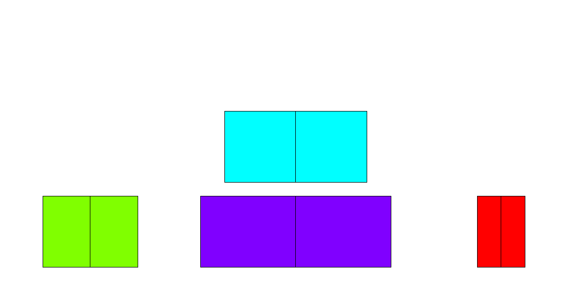

# Tower of Hanoi - T-SQL Game
T-SQL Code for popular Tower of Hanoi Game

Github Repository with T-SQL script for Microsoft SQL Server for playing popular game: 'Tower of Hanoi' in your favorite editor.

## About the game

Tower of Hanoi is puzzle game consisting of three rods and number of rings (disks) of different size (diameters). Rings are slide into any rod. Game begins with all rings stacked on one rod, ordered by descending size - from smallest on top, to biggest at the bottom.
The purpose of the game is to move the entire stack of rings from first to last rod, ordered by decreasing size.
Two simple rules apply:
1. only one ring can be moved at the time
2. bigger ring can not be stacked on smaller ring
3. each move consists of taking upper most ring and placing it on the other rod (on top of another stacked rings or on empty rod)


<!-- -->
<div style="text-align:center"></div>


## T-SQL Procedures for the game

This


## Forking or cloning the repository
To work in GitHub, go to https://github.com/tomaztk/Tower_of_Hanoi_sql_game and fork the repository. Work in your own fork and when you are ready to submit to make a change or publish your sample for the first time, submit a pull request into the master branch of this repository. 

You can also clone the repository. Note: further changes should be fetched manually.


```
git clone -n https://github.com/tomaztk/Tower_of_Hanoi_sql_game
```

## Code of Conduct
Collaboration on this code is welcome and so are any additional questions or comments.


## License
Code is licensed under the MIT license.

### ToDO
1. Prettify T-SQL code
2. Implementing procedures in Power BI or SSRS :-)
   